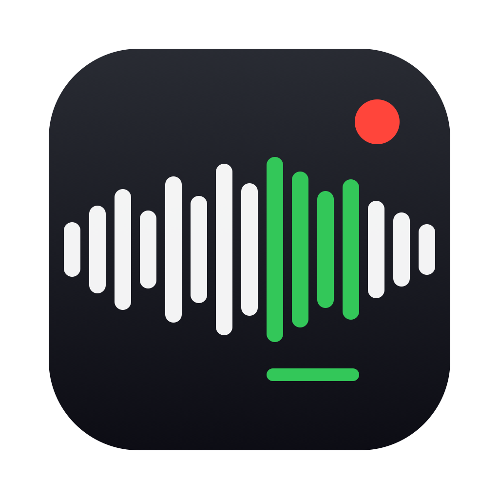

# Listening Clip Pipe

[English](README.md) | **中文**

> 把你没听懂的那几秒钟抓下来——一个快捷键，直接进笔记。

Listening Clip Pipe 是一个为**雅思听力训练**（以及一切认真的语言听力学习）设计的 macOS 菜单栏工具。按 **⌥Z** 开始录制整场听力（系统音频，不用麦克风），屏幕右上角出现一条悬浮时间轴。听到连读、弱读、吞音听不懂时，敲一下**空格**在时间轴上开一个**绿色标记**，再敲一下空格闭合。整场听力想标几处标几处。再按 **⌥Z** 停止：每个绿段切成独立的音频小文件，**总录音 + 全部绿段**一起进剪贴板——一次 Cmd+V 全部粘进飞书 / Notion / 任意文档。没打标？那就和普通录音一样，粘出完整一条。

从 **1.0 版本**起步——完整的「捕获 → 保存 → 粘贴」流水线，刻意保持极简。

## 它解决什么问题

传统流程里，雅思听力有 3 秒没听懂想留档：找到音频文件、拖进度条定位、剪出片段、导出、上传到笔记、再写错因——3 秒的音频要 5 分钟的操作。摩擦太大，所以没人真的做，听不懂的地方永远不会被复习到。

Listening Clip Pipe 把这一切压缩成两次按键：

- **🎧 录的是你耳朵里的声音，不是麦克风。** 直接捕获 macOS 系统音频输出（Core Audio Process Tap），戴耳机也能录，零环境噪音。
- **⚡ 空格就是打标键，零切换成本。** 录制期间敲一下空格开绿段、再敲一下闭合——对"没听懂"的反应速度快到极致，全程不离开播放器。空格只在录音期间被独占（免权限的 Carbon 热键），停止后立刻恢复。
- **⏪ 提前量，刻画"听了一半才发现不会"。** 人意识到没听懂时，那句话已经过去一半了。菜单里的 **Mark Pre-roll**（0.1–1s）会把每个绿段的起点向前回拨，切出来的片段包含你反应过来之前的那部分。
- **🔴 实时时间轴，录音状态绝不会看漏。** 录制期间屏幕右上角悬浮一条置顶时间轴——脉冲 REC 计时、打标计数、所有绿段按位置实时绘制。全屏 App 之上也可见，鼠标事件穿透。可选：菜单里的 **Show On-Screen Timeline** 可随时开关。
- **📋 停止即可粘贴。** 片段以文件形式进入剪贴板，Cmd+V 直接插到你写错因分析的位置。
- **▶️ 内置播放器 + 可视化绿标编辑。** 在录音库点击任意一条录音进入详情页：播放/暂停（空格）、可拖动跳转的进度条（绿标直接画在上面），以及完整的绿标编辑——在播放头位置新建绿标（默认 0.5s）、拖动两端圆形手柄调整起止、删除，保存后自动按新区间重新切分文件。
- **📝 一键 ASR 分析报告。** 录音库窗口（双击 App 图标，或菜单 → Library）列出所有历史录音，带播放/删除/转录按钮。「转录」会调用 SiliconFlow ASR（SenseVoiceSmall）转写总录音**和**每个打标段，生成 Markdown 报告落盘到 `reports/`：全文转录中把你没听懂的部分**原位加粗标注**（模糊匹配定位），对应的片段音频链接就放在旁边——后续可直接接飞书 CLI 上传。全局提前量和 API Key（只存本机，绝不进仓库）都在同一个窗口里设置。
- **🤖 为 AI / 脚本批处理而设计。** 每段音频有唯一 ID、结构化文本锚点、独立 metadata JSON 和总索引——之后你（或一个 LLM agent）可以批量处理你的"听不懂合集"：转写、标注连读/弱读类型、生成复习计划。
- **🔒 完全本地，权限极简。** 无云端、无账号、无数据上报。只需要「仅录制系统音频」一项权限——不要麦克风、不要屏幕录制、不要辅助功能。

## 环境要求

- macOS 14.4+（Apple Silicon 或 Intel）
- Xcode Command Line Tools（从源码构建用）

## 安装

```bash
git clone https://github.com/wanglikai121666-stack/listening-clip-pipe.git
cd listening-clip-pipe
./build_app.sh
cp -R build/ListeningClipPipe.app /Applications/
open /Applications/ListeningClipPipe.app
```

菜单栏出现波形图标。首次按 ⌥Z 时 macOS 会请求授权：**系统设置 → 隐私与安全性 → 屏幕与系统音频录制 → 仅录制系统音频**，允许后再按一次 ⌥Z 即可。

## 使用方法

1. 按 **⌥Z**，开始播放雅思听力 / 播客 / 课程音频——整场录制中，悬浮时间轴出现（此时空格是打标键，其他 App 收不到空格）。
2. 听到听不懂的地方 → 敲 **空格**：时间轴上开一个绿段（起点按提前量设置自动回拨）。
3. 这个难点过去了 → 再敲 **空格** 闭合绿段。每个没听懂的地方都重复 2–3，时间轴上一目了然。
4. 这场听力结束 → 按 **⌥Z**。每个绿段切成独立 WAV，剪贴板写入**总录音 + 全部绿段**（最后一个绿段没闭合的话，以停止时刻为其结束）。没打标则只有完整一条，和普通录音一样。
5. 切到笔记 **Cmd+V**——一次全部粘出，在每个片段旁写下听错了什么、为什么听错。

菜单栏菜单还提供：**Start/Stop Recording**、**Mark (Space)**（纯鼠标备选）、**Copy Last Clip + Anchor**、**Copy Last Clip**、**Copy Last Anchor**（粘贴失败时补救用）、**Mark Pre-roll**（0.1–1s 提前量）、**Show On-Screen Timeline**、**Open Clips Folder**。

## 数据结构

所有数据在 `~/Documents/ListeningClipPipe/` 下：

```
~/Documents/ListeningClipPipe/
├── reports/
│   └── LC_20260626_213522_听力分析.md   # ASR 分析报告（全文转录 + 没听懂部分标注）
├── clips/
│   ├── LC_20260626_213522_总录音.wav     # 总录音（没打标时为 LC_xxx.wav）
│   ├── LC_20260626_213522_第1段切分.wav  # 打标片段 1
│   ├── LC_20260626_213522_第2段切分.wav  # 打标片段 2
│   └── LC_20260626_213522.json          # 本次会话元数据（含各绿段时间区间）
└── clips_index.json                # 总索引，供批量整理（如后续 ASR 分析）
```

每次会话的文本锚点（用于在文档里语义定位音频）：

```
🎧 AUDIO_CLIP_ID: LC_20260626_213522
duration: 754.2s
local_file: LC_20260626_213522_总录音.wav
source: system_audio
marks: 2
  - LC_20260626_213522_第1段切分.wav (12.3s–20.1s)
  - LC_20260626_213522_第2段切分.wav (95.0s–101.4s)
note:
```

## 粘贴兼容性说明

- **打过标的会话** → 剪贴板是多文件复制（等价于 Finder 多选 Cmd+C）：总录音 + 全部切分段，一次 Cmd+V 全部粘出。
- **没打标的会话** → *composite* 模式：同一个剪贴板条目同时携带文件 URL 和文本锚点，多数编辑器会取文件。

如果目标 App 粘出来的不符合预期，用菜单里的 **Copy Last Clip** / **Copy Last Anchor** / **Copy Last Clip + Anchor** 兜底。

## 版本范围与路线图

当前版本（v1.5.x）做捕获、打标、切分、本地存储、剪贴板、内置播放器与可视化绿标编辑，以及按需的 ASR 分析报告（SiliconFlow SenseVoiceSmall，自备 API Key，在录音库窗口设置）。暂不包含：飞书 API 同步（接口已在 `FeishuSyncService.swift` 预留；报告本身就是为外部 CLI 上传设计的）、回放/复习 UI、间隔复习计划、Anki 导出。得益于结构化的本地数据（会话元数据里的绿段时间区间 + 总索引），这些都可以在不改动捕获流水线的前提下往上叠。

## 常见问题

- **`swift build` 失败 / `import Foundation` 报 `SwiftBridging` 重复定义**：部分新旧混装的 Command Line Tools 会残留一个旧的 `module.modulemap`。`build_app.sh` 直接用 `swiftc` 编译并自动应用 VFS overlay 绕过；永久修复：`sudo mv /Library/Developer/CommandLineTools/usr/include/swift/module.modulemap{,.bak}`。
- **重新构建后又弹权限**：构建使用 ad-hoc 签名，每次重建签名都会变化。日常使用建议固定用 `/Applications` 里的那份。
- **按 ⌥Z 没反应**：确认菜单栏图标在（App 在运行），且 ⌥Z 没有被其他 App 注册为全局快捷键。
- **空格打不出空格了**：录音会话还在进行中（菜单栏图标是红色）——按 ⌥Z 停止，空格立刻恢复。

## 许可证

[MIT](LICENSE)
